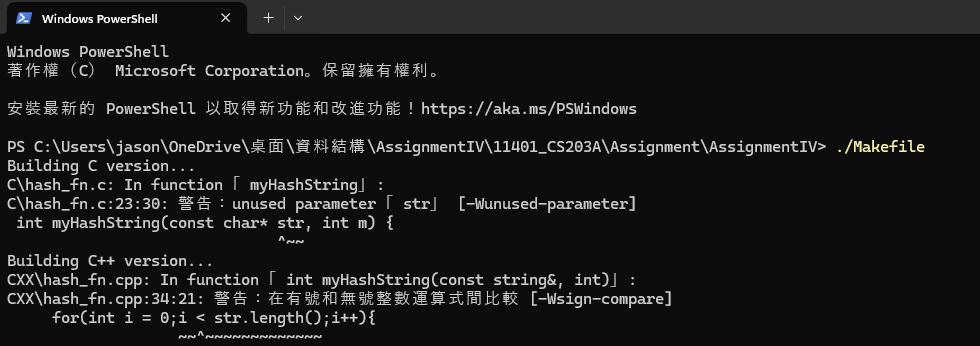
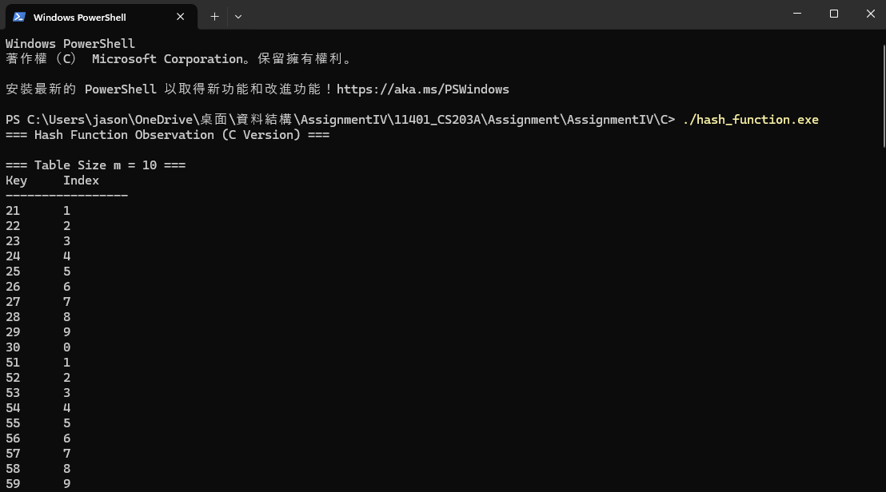

# a.開發環境
- 作業系統: Windows 11
- IDE: Visual Studio Code

# b.hash function設計
- integer: Multiplicative Hash
    ```
    FUNCTION myHashInt(key, m):
        A = 0.618033
        h = key * A - Floor(key * A) 
        RETURN INTEGER(m × h)
    ```

- string: FNV‑1a
    ```
    FUNCTION myHashString(str, m):
        FNV_offset = 2166136261
        FNV_prime  = 16777619
        hash = FNV_offset

        FOR each character c in str:
            hash = hash XOR ASCII_VALUE(c)
            hash = hash * FNV_prime
        END FOR
        RETURN INTEGER(hash MOD m)
    ```

# c.Results
- key與index呈現較均勻分布
- m為指數時，collison發生率較低

# d.Compilation, build, execution and output
i. Compilation, build  


ii. Output  
C:  
  
[(<C Output.txt>) ](<../C Output.txt>) 

C++:  
  
[(<C Output.txt>)](<../C++ Output.txt>)

# e.Analysis
- Multiplicative Hash 對整數 key 的分布均勻，但仍可能因 table size 選擇而出現 collision
- FNV-1a 對字串 key 有良好分布，對大小寫敏感，可有效減少碰撞次數
- Table size 選擇質數可降低 collision 發生率

# f.Reflation
- Hash function 設計需兼顧分布均勻與運算效率
- 質數 table size 可減少碰撞
- key分布的越均勻，collision 發生率越低

# g.reference
[https://hackmd.io/@Zero871015/DSNote-20](https://hackmd.io/@Zero871015/DSNote-20)  
[https://www.cnblogs.com/davygeek/p/10705721.html](https://www.cnblogs.com/davygeek/p/10705721.html)
